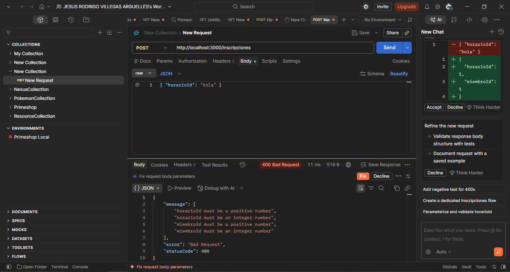
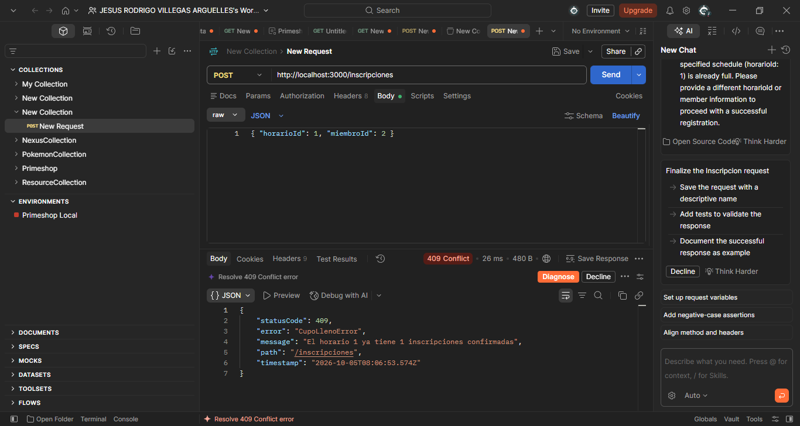
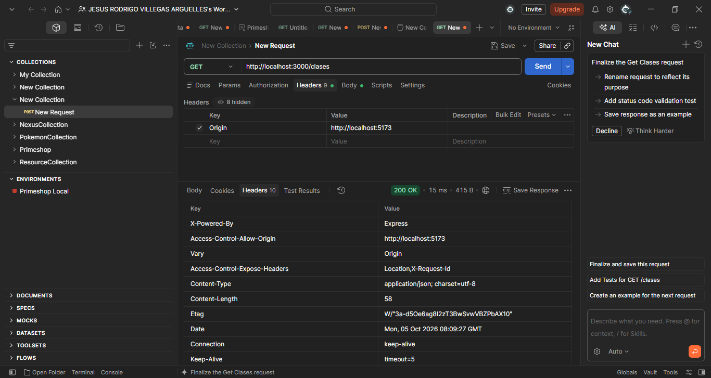
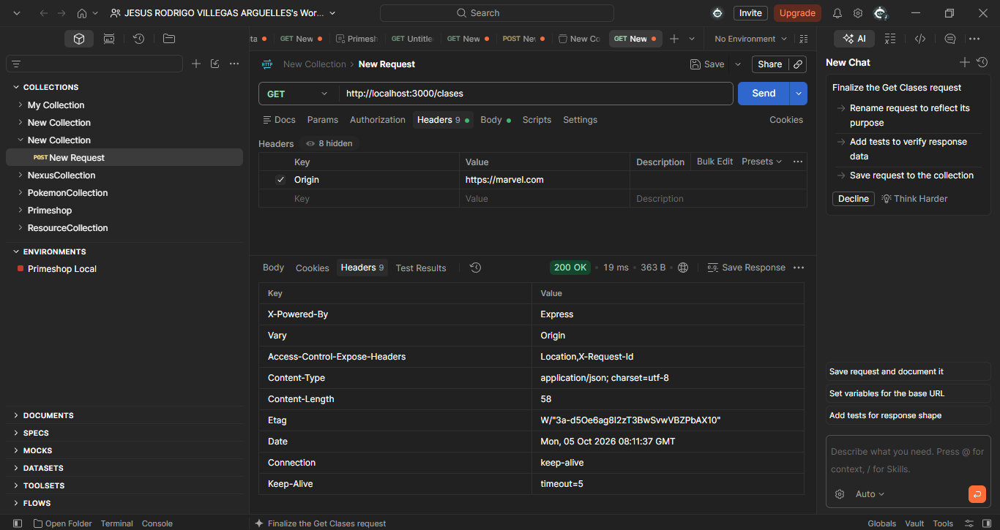

# Gimnasio API — Código base (Semana 5)

API REST en NestJS para el gimnasio: `Clases`, `Horarios`, `Miembros` e `Inscripciones`, cada
módulo con dominio, DTOs e infraestructura separados (patrón repositorio + inyección por token).
Los datos viven en memoria — ningún repositorio se conecta todavía a una base de datos real.

Este proyecto es el punto de partida de la Práctica 8 (Prisma) y la Práctica 9 (Blindar la API).

## Preguntas Práctica 8.

**1. ¿Por qué el paquete del adaptador se llama adapter-mariadb si usamos MySQL?**
Porque MariaDB nació como un fork de MySQL y todavía usa el mismo protocolo de conexión. 

**2. ¿Editar schema.prisma cambió algo en la base de datos antes de migrar?**
No, el schema.prisma solo es un archivo de texto que describe cómo quiero mi base, pero no toca nada todavía. 

**3. ¿La carpeta de migraciones es una foto del esquema o un historial?**
Es un historial, cada carpeta que se crea dentro de migrations guarda el SQL que se necesitó en ese momento para pasar del estado anterior al nuevo, entonces si las abro en orden puedo ver cómo fue creciendo la base desde el inicio.

**4. ¿Por qué Horario.clase sí crea columna y Clase.horarios no?**
Porque Horario es el lado que tiene la llave foránea (claseId), o sea el lado "muchos" de la relación. El @relation con fields y references es el que le dice a Prisma en qué tabla va la columna real. Clase.horarios solo es para poder acceder a los horarios desde el código, pero en la base de datos no genera ninguna columna.

**5. ¿De dónde sale la relación de muchos a muchos entre Miembro y Horario, si nunca se declaró?**
Sale de la tabla Inscripcion, que funciona como tabla intermedia con una llave foránea hacia Horario y otra hacia Miembro. 

## Preguntas Práctica 9.

**1. ¿Qué línea del Service o del Controller tuvo que cambiar para que Clases hablara con MySQL?**
Ninguna, solo cambié el useClass en clases.module.ts de ClaseMemoriaRepository a ClasePrismaRepository. El Service y el Controller solo conocen la interfaz ClaseRepository.

**2. ¿Por qué InscripcionesService no tuvo que cambiar ni una línea de las reglas de cupo y duplicados?**
Porque el Service solo usa los métodos de la interfaz InscripcionRepository y no le importa si los datos vienen de memoria o de MySQL. 

**3. ¿Por qué una interfaz no puede validar nada en tiempo de ejecución?**
Porque las interfaces desaparecen al compilar, entonces cuando corre el programa ya no existen y no hay dónde guardar las reglas de validación. Una clase sí sigue existiendo y ahí se guardan los decoradores.

**4. Una de las cuatro opciones del ValidationPipe es indispensable: sin ella la validación no hace nada y tampoco avisa. ¿Cuál es?**
transform: true. Sin ella el cuerpo llega como objeto plano, class-validator no llega a correr y la validación no hace nada, pero tampoco marca ningún error.

**5. ¿Qué código de estado responde y qué trae en el cuerpo?**
Sale un 400 Bad Request. En el cuerpo viene message (un arreglo con cada regla que falló), error y statusCode. 

**6. ¿Cuántas líneas quedó más corto el controlador?**
Quedó 26 líneas más corto.

**7. Si la respuesta llega en los dos casos, ¿quién bloquea realmente y a quién protege?**
Bloquea el navegador, no el servidor. El servidor responde igual en los dos casos (200 en mis dos pruebas), pero si el origen no está permitido el navegador no deja que la página lea la respuesta. 

## Evidencias

**400 de validación**



**409 traducido por el filtro**



**CORS con origen permitido**



**CORS con origen no permitido**



**Diagrama de la base de datos**


## Cómo correrlo

```bash
npm install
npm run start:dev
```

El servidor levanta en `http://localhost:3000`. En `peticiones.http` está la batería completa de
pruebas (requiere la extensión "REST Client" de VS Code).

## Estructura

```
src/
  clases/        CRUD de clases del gimnasio
  horarios/      CRUD de horarios (día, hora, cupo, entrenador)
  miembros/      CRUD de miembros del gimnasio
  inscripciones/ inscribir a un miembro a un horario, con reglas de cupo y duplicados
  datos/         datos de arranque (seed) que usan Horarios y Miembros
```

Cada módulo sigue la misma forma: `dominio/` (entidades + interfaz del repositorio), `dto/`,
`infra/` (repositorio en memoria) y el token de inyección en `<módulo>.tokens.ts`.
